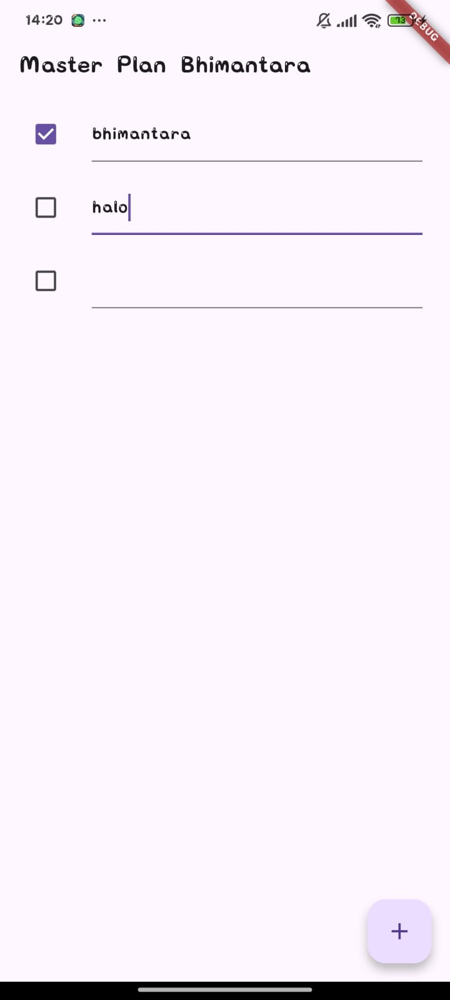

# **Laporan Praktikum Flutter – Master Plan App**

**Nama:** Muhammad Bhimantara Wira Eka Putra
**Kelas:** SIB 3C
**No. Absen:** 25
**Mata Kuliah:** Pemrograman Mobile
**Jurusan:** Teknologi Informasi
**Program Studi:** D-IV Sistem Informasi Bisnis

---

### Praktikum 1

### Langkah 1 — Membuat Struktur Folder dan File Utama

Pada langkah pertama, dilakukan pembuatan struktur awal proyek Flutter menggunakan perintah:

* Membuat project Flutter di VS Code
  

### Langkah 2 — Membuat Class Task
Membuat class `Task` pada folder `models/` untuk merepresentasikan satu tugas dengan atribut `description` (deskripsi tugas) dan `complete` (status selesai).


### Langkah 3 — Membuat Class Plan
Membuat class `Plan` untuk menyimpan daftar tugas (`tasks`) dan nama rencana (`name`). Class ini merepresentasikan satu perencanaan kegiatan.


### Langkah 4
Membuat file `data_layer.dart` berisi class `Plan` dan `Task` untuk mendefinisikan struktur data rencana dan tugas.


### Langkah 5
Membuat file `plan_screen.dart` di folder `screens` sebagai tampilan utama aplikasi.


### Langkah 6
Membuat StatefulWidget bernama PlanScreen sebagai dasar tampilan utama.


### Langkah 7
Menambahkan inisialisasi objek Plan dan membuat tombol tambah tugas (FloatingActionButton).


### Langkah 8
Menambahkan ListView untuk menampilkan daftar tugas secara dinamis.


### Langkah 9
Menambahkan widget ListTile dengan Checkbox dan TextFormField untuk setiap item tugas.


### Langkah 10
Menambahkan ScrollController untuk mengatur perilaku scroll agar keyboard tertutup otomatis saat user menggulir layar.


### Langkah 11
Menambahkan method initState() untuk menginisialisasi ScrollController dan menambahkan listener.


### Langkah 12
Menambahkan properti controller dan keyboardDismissBehavior pada ListView agar pengalaman input lebih nyaman di iOS/Android.


### Langkah 13
Menambahkan method dispose() untuk membersihkan ScrollController saat widget tidak digunakan lagi.


### Langkah 14 – Jalankan dan Uji Aplikasi
Menjalankan aplikasi Flutter menggunakan perintah flutter run, kemudian menguji semua fitur.



### Tugas Praktikum 1

1. Maksud Langkah 4

Langkah 4 bertujuan membuat file data_layer.dart yang berisi class Plan dan Task untuk mendefinisikan struktur data aplikasi. Hal ini dilakukan agar logika data (Model) dipisahkan dari tampilan (View), sehingga kode lebih terstruktur, mudah dikembangkan, dan perubahan data dapat dikelola secara terpusat tanpa memengaruhi UI langsung.

2. Variabel plan di Langkah 6 dan alasan dibuat konstanta

Variabel plan digunakan untuk menyimpan state daftar tugas yang sedang aktif. Pada awalnya dibuat sebagai konstanta (const Plan()) agar Flutter dapat mengoptimalkan penggunaan memori dan memastikan nilai awal aman serta stabil sebelum pengguna menambah atau mengubah task menggunakan setState(). Hal ini juga mencegah kesalahan null atau error saat build pertama kali.

3. Hasil Langkah 9

Pada langkah 9 dibuat widget _buildTaskTile() yang menampilkan setiap task dalam bentuk ListTile dengan Checkbox dan TextFormField. Fungsi ini memungkinkan pengguna menandai task selesai atau mengubah deskripsinya secara langsung, sehingga daftar tugas menjadi interaktif dan dinamis. Hasil capture GIF menunjukkan bagaimana task dapat ditambah, diedit, dan dicentang, dengan tampilan UI langsung terupdate.

4. Kegunaan method Langkah 11 dan 13 dalam lifecycle state

Method initState() pada langkah 11 digunakan untuk menginisialisasi ScrollController dan menambahkan listener, sehingga saat user melakukan scroll semua TextField kehilangan fokus dan keyboard otomatis tertutup. Sedangkan dispose() pada langkah 13 dipanggil ketika widget dihapus dari widget tree untuk membersihkan resource, mencegah memory leak, dan memastikan manajemen lifecycle widget berjalan dengan baik sesuai prinsip Flutter.


### Praktikum 2

### Langkah 1 — Membuat Folder provider dan File provider
* folder dan file
  
  


### Langkah 2: Edit main.dart
* edit
  

### Langkah 3: Tambah method pada model plan.dart
 * Menambahkan code ke dalam file plan.dart
  

### Langkah 4: Pindah ke PlanScreen
* hapus code
  

### Langkah 5: Edit method _buildAddTaskButton
* Edit method dalam file plan_screen
  

### Langkah 6: Edit method _buildTaskTile
* Menambahkan parameter BuildContext context, Ganti TextField menjadi TextFormField.
  

  ### Langkah 7: Edit _buildList
  * Menambahkan parameter buildlist
   

### Langkah 8: Tetap di class PlanScreen
* edit method
  

### Langkah 9: Tambah widget SafeArea
* Menambahkan widget SafeArea
  


 ### Hasil :
   

   Setelah langkah 9 selesai, aplikasi kini menampilkan daftar tugas dari objek Plan dalam bentuk ListView dengan setiap item berisi Checkbox dan TextFormField untuk menandai serta mengedit tugas. Pengguna dapat menambah tugas baru lewat tombol FloatingActionButton (+), dan perubahan akan langsung terlihat tanpa setState(). Di bagian bawah layar, teks progres seperti “1 out of 3 tasks” otomatis memperbarui sesuai jumlah tugas yang selesai. Semua pembaruan terjadi secara reaktif berkat PlanProvider dan ValueListenableBuilder yang memastikan tampilan selalu sinkron dengan data.


### Praktikum 2: Mengelola Data Layer dengan InheritedWidget dan InheritedNotifier

## 1. Penjelasan InheritedWidget pada Langkah 1

Pada langkah pertama, kita membuat sebuah kelas bernama `PlanProvider` yang menurunkan `InheritedNotifier<ValueNotifier<Plan>>`.  
Secara sederhana, `InheritedWidget` adalah widget bawaan Flutter yang digunakan untuk **mendistribusikan data ke seluruh bagian aplikasi** tanpa perlu mengirim data secara manual melalui konstruktor widget.

Namun dalam praktikum ini, kita tidak langsung menggunakan `InheritedWidget`, melainkan **`InheritedNotifier`**.  
Alasannya, `InheritedNotifier` merupakan versi yang lebih canggih karena dapat **mendengarkan perubahan data secara otomatis**. Saat data diubah melalui `ValueNotifier`, seluruh widget yang bergantung pada data tersebut akan **langsung diperbarui** tanpa perlu memanggil `setState()` secara manual.

Dengan kata lain, `InheritedNotifier` membuat proses sinkronisasi antara data dan tampilan menjadi otomatis dan efisien.
Inilah alasan utama mengapa kita menggunakan `InheritedNotifier` di langkah ini — agar pengelolaan state lebih rapi, efisien, dan terpusat.

---

## 2. Penjelasan Method pada Langkah 3

Pada langkah ketiga, kita menambahkan dua buah method ke dalam model `Plan`, yaitu:

```dart
int get completedCount => tasks
    .where((task) => task.complete)
    .length;

String get completenessMessage =>
    '$completedCount out of ${tasks.length} tasks';


---

### Praktikum 3 : Membuat State di Multiple Screens

### Langkah 1: Edit PlanProvider
* edit code
  

  Error itu muncul karena kamu mengubah PlanProvider agar menyimpan daftar plan (List<Plan>), sementara kode lain masih menganggap isinya hanya satu plan (Plan). Akibatnya, bagian seperti plan.tasks jadi tidak cocok dengan tipe datanya dan memunculkan error. Jadi, penyebabnya karena ketidaksesuaian tipe data. Solusinya, kamu bisa sesuaikan semua kode agar mendukung banyak plan sekaligus, atau kembalikan PlanProvider seperti semula kalau kamu cuma butuh satu plan saja.

### Langkah 2: Edit main.dart
* edit main


### Langkah 3: Edit plan_screen.dart
* Edit code


### Langkah 4: Error
Langkah 3–4 menyebabkan error karena sebelumnya PlanProvider hanya menyimpan satu objek Plan, sedangkan setelah diubah menjadi List<Plan>, semua bagian kode yang masih memanggil PlanProvider.of(context) dengan asumsi tipe data tunggal menjadi tidak sesuai lagi. Akibatnya, fungsi-fungsi yang mengakses plan atau memodifikasi tugas tidak bisa mengenali struktur baru List<Plan>. Error ini muncul karena perbedaan tipe data antara implementasi lama dan baru, sehingga referensi ke data plan harus diperbarui agar menyesuaikan dengan daftar plan yang baru.


### Langkah 5: Tambah getter Plan
* ganti akses


### Langkah 6: Method initState()
* Tambah parameter


### Langkah 7: Widget build
* Tambah parameter


### Langkah 8: Edit _buildTaskTile
* Tambah parameter


### Langkah 9: Buat screen baru
* buat file baru dan isi dengan kode

 
### Langkah 10: Pindah ke class _PlanCreatorScreenState
* Tambahkan Parameter


### Langkah 11: Pindah ke method build
* Tambahkan Parameter


### Langkah 12: Buat widget _buildListCreator
* Tambahkan Parameter


### Langkah 13: Buat widget _buildListCreator
* Tambahkan Parameter


