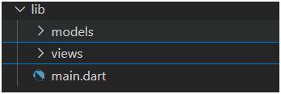

# **Laporan Praktikum Flutter – Master Plan App**

**Nama:** Muhammad Bhimantara Wira Eka Putra
**Kelas:** SIB 3C
**No. Absen:** 25
**Mata Kuliah:** Pemrograman Mobile
**Jurusan:** Teknologi Informasi
**Program Studi:** D-IV Sistem Informasi Bisnis

---

### Langkah 1 — Membuat Struktur Folder dan File Utama

Pada langkah pertama, dilakukan pembuatan struktur awal proyek Flutter menggunakan perintah:

* Membuat project Flutter di VS Code
  

### Langkah 2 — Membuat Class Task
Membuat class `Task` pada folder `models/` untuk merepresentasikan satu tugas dengan atribut `description` (deskripsi tugas) dan `complete` (status selesai).

### Langkah 3 — Membuat Class Plan
Membuat class `Plan` untuk menyimpan daftar tugas (`tasks`) dan nama rencana (`name`). Class ini merepresentasikan satu perencanaan kegiatan.

### Langkah 4
Membuat file `data_layer.dart` berisi class `Plan` dan `Task` untuk mendefinisikan struktur data rencana dan tugas.

### Langkah 5
Membuat file `plan_screen.dart` di folder `screens` sebagai tampilan utama aplikasi.

### Langkah 6
Membuat StatefulWidget bernama PlanScreen sebagai dasar tampilan utama.

### Langkah 7
Menambahkan inisialisasi objek Plan dan membuat tombol tambah tugas (FloatingActionButton).

### Langkah 8
Menambahkan ListView untuk menampilkan daftar tugas secara dinamis.

